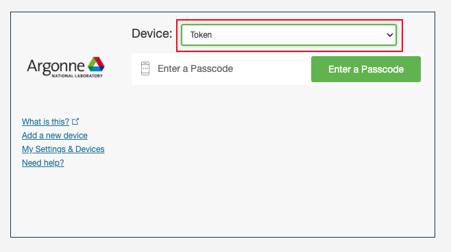
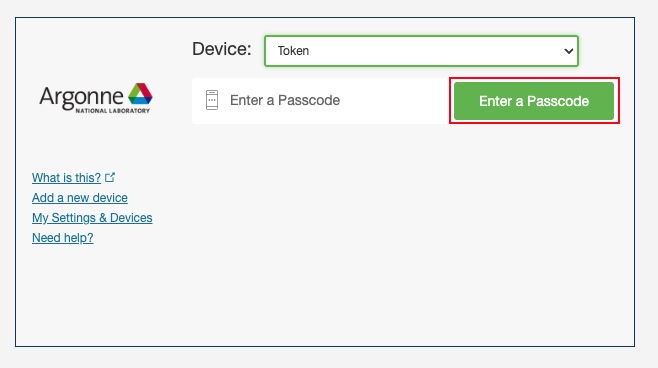
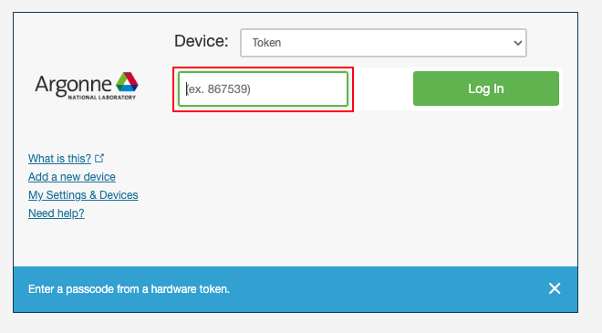

# Acquiring a Yubikey for MFA

If you cannot install the Duo Mobile App for MFA to LCRC systems, you will need to be given a physical Yubikey hardware token. Please contact [LCRC Support](mailto:support@lcrc.anl.gov) to begin this process. 

After you have been given a Yubikey by LCRC staff for MFA either in person or by mail, contact [LCRC Support](mailto:support@lcrc.anl.gov) once again. Give them the Serial Number listed on the physical Yubikey hardware token and they will add it to your LCRC account manually. Once added and notified by LCRC staff, you should be able to login to the [LCRC Accounts page](https://accounts.lcrc.anl.gov) and LCRC clusters with your Yubikey instead of Duo. All future logins will require your MFA token.

# Logging into the LCRC Accounts Page

1. Make sure your physical Yubikey hardware token is plugged into a USB slot on your local computer.

2. Login to [https://accounts.lcrc.anl.gov](https://accounts.lcrc.anl.gov) with your Argonne Domain or Argonne Collaborator account username and password. If you have forgotten your password, please call the Argonne Service Desk at +1-630-252-9999.

3. You should be prompted to select a Device. Select **Token** in the Device dropdown. 


4. Press the **Enter a Passcode** button.


5. Click on the highlighted text box so it takes input. Do not enter any text.


6. On your physical Yubikey hardware token, press the button for 1 to 2.5 seconds. A random string of text will be entered into the text box and a return character will be sent as well. It should automatically log you in to the accounts page now, you should not have to press the Log In button.

# Logging into LCRC Clusters

Once your Yubikey is working, you can also [configure your SSH key](ssh.md) to complete our login requirements for MFA into LCRC clusters. Make sure your SSH key is configured and when you SSH to a cluster, you should be prompted to use your token after your SSH key authenticates. The output should look similar to the below:

```
Duo two-factor login for <username>

Enter a passcode or select one of the following options:

Passcode:
```

On your physical Yubikey hardware token, press the button for 1 to 2.5 seconds. A random string of text will be entered into the CLI and a return character will be sent as well. It should automatically log you in to the cluster now.

As a reminder, please contact [support@lcrc.anl.gov](mailto:support@lcrc.anl.gov) with any issues.
