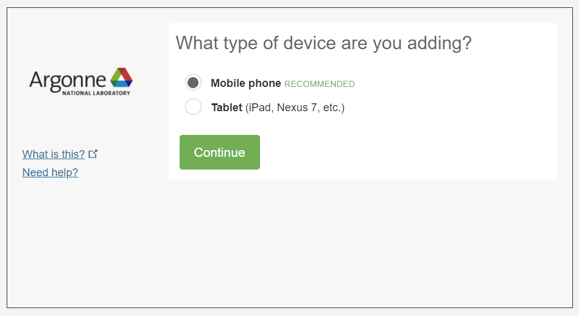
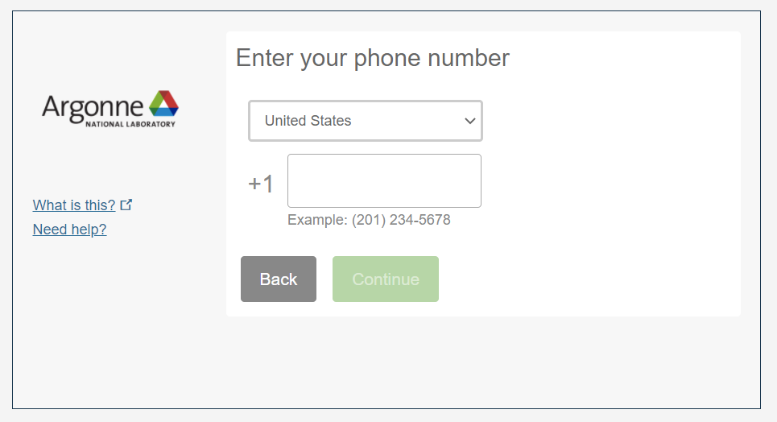
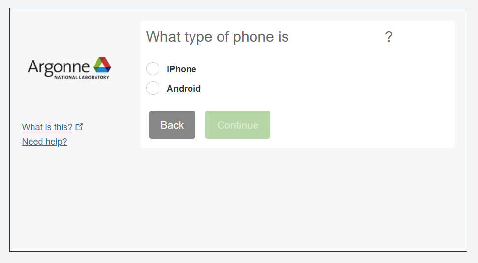
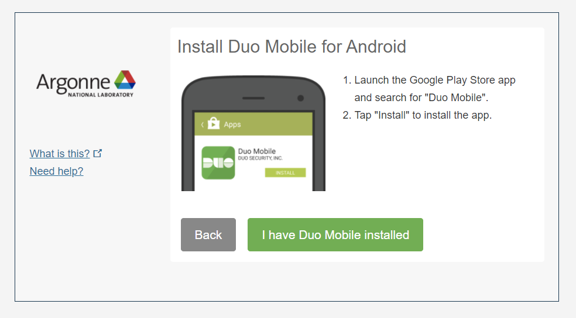
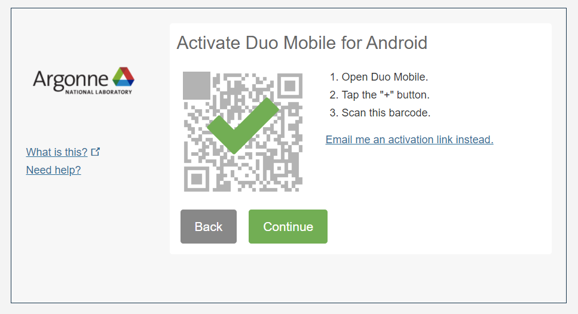
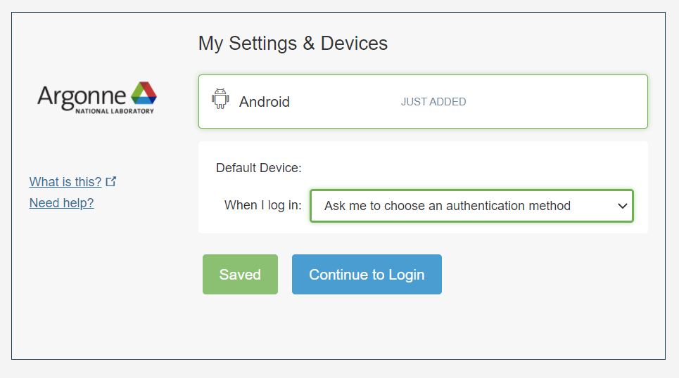
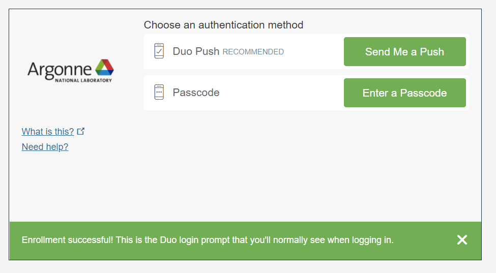

*NOTE*: LCRC Duo Enrollment will begin on **August 19, 2024**. Please revisit this page on or after that time.
To ensure your device is compatible, you can try installing the Duo Mobile App in advance.

# Enrolling in Duo MFA

After you have [joined the **lcrc** project or a sub-project of LCRC](../project-management/#join-an-existing-lcrc-project) (current LCRC users should already be in a project), you will be required to enroll in the CELS Duo MFA system on your next login to the [LCRC Accounts System](https://accounts.lcrc.anl.gov). If you are already logged in, you can logout and log back in to complete the setup right away.

*Note*: If you cannot install the Duo Mobile App, please first verify that your device OS is up to date. You can also reference the [Duo help documentation](https://help.duo.com) for a list of compatibile devices and versions. If you still cannot install the Duo Mobile App because your device cannot be updated, is not compatible, or you do not have a Smartphone/Tablet, please contact [support@lcrc.anl.gov](mailto:support@lcrc.anl.gov).

1. Login to [https://accounts.lcrc.anl.gov](https://accounts.lcrc.anl.gov) with your Argonne Domain or Argonne Collaborator account username and password.

2. You should be prompted to configure Duo MFA. Select the device type you want to register for Duo.

3. Add your mobile phone number.

4. Select your device OS. We will choose Android in this example.

5. Install the Duo Mobile App. The official Duo documentation has instructions for both [iOS](https://guide.duo.com/iphone) and [Android](https://guide.duo.com/android) devices.

6. Open the Duo Mobile App, tap the + button, and scan the barcode.

7. Choose your default authentication method.

8. Continue to login and test your newly added device.

As a reminder, please contact [support@lcrc.anl.gov](mailto:support@lcrc.anl.gov) with any issues.

Once Duo MFA is configured, you can now [configure your SSH key](ssh.md) to complete our login requirements.
