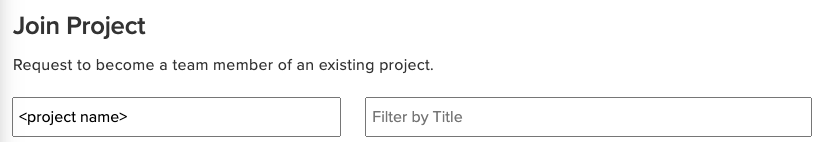

# Managing Projects

This page describes projects in detail, including policies, concepts, background, etc.

## The Project Life Cycle

Projects normally go through the following life cycle. Detailed descriptions of the life cycle will be elaborated further down on this page.

* The Principal Investigator (PI) requests a project using at [https://accounts.lcrc.anl.gov](https://accounts.lcrc.anl.gov). The PI must be a current Argonne employee.
* The project request is sent to the LCRC Allocations Administrator and to the LCRC Allocations Committee.
* The committee's decision is reported via email to the project requester.
* If the project has been approved, the mail will include the number of hours allocated to the project. This number may be different from what was requested. This number may also be some initial allocation that will subsequently be augmented based on decisions by the LCRC Allocations Committee.
* As a part of creating the project, someone on the LCRC Allocations Committee will be affiliated with the project as a Point of Contact (PoC). That person will be the project's contact on the committee. They are expected to become moderately familiar with the project, to act as the project's advocate if necessary, and to be able to explain the project and the project's status to the committee.
* Every fiscal quarter starting October 1, all projects will have their allocations zeroed out and be restarted with new allocations as requested and approved. This will be done in order to adjust and balance the use of the system. Unused time does not carry over to the next quarter.
* When making quarterly decisions, the Allocations Committee PoC will look at the usage for the previous quarter and may query any projects that have not been using most of their time to learn what their plan is for the next quarter. Sometimes they also query projects that have used a lot of time for their future plans.
* Once the project has been created, PIs can [add other users to the project, appoint Proxies (or Co-PIs), and administer the project's allocation](https://accounts.lcrc.anl.gov).
* In advance of the annual October (Argonne's new fiscal year) re-allocation, PIs will be reminded to send in a request for the next year's allocation for their project.
* Also in advance of the annual October re-allocation, PIs will also be required to provide a report on their project at that time. If reports had been sent in for previous quarters, those will be sufficient, if they are current. The basic goal here is to get at least one annual report for each project. This report will be used to help describe the overall use of the systems and will also be used when deciding on annual allocations for all projects. The format of the report will be roughly 2-3 pages long, with pictures highly encouraged. Projects that do not submit a report will not receive any new time for the new fiscal year until a report is received.
* LCRC allocations granted each quarter use Argonne's fiscal calendar. Allocations are granted on the first day of the new fiscal quarter at midnight. Quarters are divided into the following time frames:
  * 1st Quarter (October 1 – December 31)
  * 2nd Quarter (January 1 – March 31)
  * 3rd Quarter (April 1 – June 30)
  * 4th Quarter (July 1 – September 30)

---

## Example Project: "Popcorn"

Let's explore a sample project to illustrate how the LCRC allocation system functions. The project, named **popcorn**, aims to simulate Popcorn Kernel Dynamics. It involves a Principal Investigator (PI) and three collaborating scientists.

### Project Life Cycle & Initial Allocation

After its creation, **popcorn** would be granted an initial allocation, for instance, **5,000 node-hours for the quarter**.

### Usage Scenario

Imagine one of the collaborating scientists runs a job that takes **10 hours** and utilizes **25, 128-core nodes**. This would consume:

* `10 hours (job duration) x 25 nodes = 250 node-hours`

As a result, **4,750 node-hours** would remain from the original allocation.

### Running Out of Node-Hours

Once all **4,750 remaining node-hours** are exhausted, the project will be unable to execute additional jobs. At this point, the team would need to consider requesting more computational time.

### Requesting Additional Allocation

The designated PI can formally request additional node-hours for the project. This request will be subject to review and approval by the **LCRC Allocations Committee**.

* **Communication**: The decision on the request will be emailed to the PI upon completion of the required web form.

### Additional Resources

For a practical guide to project allocation requests, refer to the [Sample Project Request](https://accounts.lcrc.anl.gov/sample_project_request.pdf).

---

## Project PIs and User Accounts

Each project within the LCRC system is managed by at least one **Primary Investigator (PI)**. The PI serves as the main point of contact for matters like resource allocations. In addition, projects can have **Proxies** (also known as Co-PIs) who share managerial responsibilities with the PI.

### Eligibility for PIs and Proxies

* **Primary Investigator (PI)**: Must be permanent Argonne staff or Argonne associates.
* **Proxies (Co-PIs)**: Also need to be permanent Argonne staff or Argonne associates.

Resident associates, Joint Appointments, Visiting faculty/students/intern should have their ANL supervisors be the PIs for their projects.

### User Account Association

A project can have various levels of user involvement:

* **Single User**: Some projects might only have one user account, which is the PI.
* **Multiple Users**: Other projects could involve multiple user accounts, possibly even dozens.
  
A single user account can be associated with multiple projects and can also serve as the PI for multiple projects.

### Roles and Responsibilities

#### PI Responsibilities

1. **User Management**: The PI is in charge of adding and removing user accounts linked to the project.
2. **Allocation Management**: The PI administers the node-hour allocations for the project, outlining who among the project members is authorized to use what portion of the allocated resources.

### Summary

In a nutshell, the PI and any Proxies are responsible for both user and resource management within their projects. They are the go-to contacts for allocation decisions and administrative tasks.

---

## Requesting a New LCRC Project

### Who Can Request?

Only Argonne employees are eligible to initiate a new project within the LCRC.

### Step-by-Step Guide

**1. Log In:**

* Visit the [LCRC Accounts page](https://accounts.lcrc.anl.gov).
* Use your Argonne credentials to log in.

**2. Access the Request Link:**

* Locate and click on the **Request New LCRC Project** option in the left-hand sidebar.

  

  **Note**: If the link isn't visible, join the **lcrc** project. [Follow this guide](accounts-and-access.md#for-current-argonne-employees) for assistance.

**3. Complete the Form:**

* Provide the necessary details in the required fields.
* Click the **Request project** button upon completion.

**4. Approval Process:**

* Your project request will undergo a review cycle.
* Await an email notification regarding the approval decision.

**5. Post-Approval Actions:**

Once approved and the project is set up, you can:

* Add or remove users and Proxies (Co-PIs).
* Request additional allocations.
* Edit project information.

Your project will have a corresponding Unix group with the same name for member access.

**6. Storage Requests:**

For storage requests exceeding 1TB, provide a justification.

---

## Join an Existing LCRC Project

### Who Can Join?

Anyone with a new or existing Argonne account can request to join an existing project.

If you are an Argonne employee, you should first join the **lcrc** project. However, if you are a collaborator, you will need to join a sub-project of LCRC.

### Steps to Join a Project

**1. Contact the Project PI:**

For collaborators, if you already know the project PI within LCRC that you wish to join, contact them directly and request them to add you to the project.

**2. Self-Initiate Membership:**

If you'd like to send a request to the project PI:

**a. Access LCRC Accounts:**

* Visit the [LCRC Accounts page](https://accounts.lcrc.anl.gov).
* Log in using your Argonne credentials.

**b. Locate Join Project:**

* Click on the **Join Project** option on the left sidebar.

  

**c. Search for the Project:**

* Enter the name of the project you wish to join in the search box.
  

  
* The list will update to display projects matching your search term.

**d. Request Membership:**

* Click on the desired project name from the list.
* Then click on the **Request Membership** button.
  

**3. Approval:**

After the project owner approves your membership request, you'll have access to use the project hours for your tasks.

---

## Managing Your LCRC Project

If you hold the role of a Project Owner (PI) or a Proxy (Co-PI), you're empowered to manage and tailor your LCRC project. Follow this structured guide:

**1. Access the LCRC Account Page**:

* Visit the [LCRC Accounts page](https://accounts.lcrc.anl.gov).
* Sign in with your Argonne credentials.

**2. Find Your Project**:

* Go to **_Projects > Owned_** on the left sidebar.
* Select the project you'd like to oversee.

**3. Project Management Options**:

Within the project management dashboard, you can:

* Add or remove project members.
* Handle pending membership requests.
* Designate or exclude Proxies (Co-PIs).
* Seek more project allocations or storage.
* Update project information.

**4. Save Your Adjustments**:

* Remember to hit the **Save Project info** button post-modifications.

For support or inquiries, email [support@lcrc.anl.gov](mailto:support@lcrc.anl.gov).
