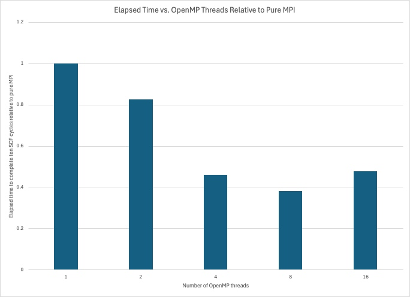

<u>**OpenMP can speed up your VASP6 calculations on Improv.**</u>

The VASP developers state, "On nodes with many cores, e.g., 64 or more. On such nodes, the memory bandwidth and cache size per core may limit the parallel efficiency of VASP. These problems can be (partly) alleviated by using OpenMP." [See the VASP manual for details.](https://www.vasp.at/wiki/index.php/Combining_MPI_and_OpenMP)

[Zhao, et al. found that for many VASP calculations, eight OpenMP threads per MPI process give the best performance on the Zen3 architecture.](https://cug.org/proceedings/cug2023_proceedings/includes/files/pap130s2-file1.pdf)

Improv's AMD EPYC 7713 Zen3 processor has eight core complexes (CCXs).  Each CCX has eight cores sharing a common L3 memory cache. VASP6 can exploit the fast bandwidth of these caches with openMP.  We have tested the effect of using VASP configured to use openMP on the elapsed time for a single gamma point calculation for a ferromagnetic Pt296Fe255 cluster with VASP v6.5.1 on eight Improv nodes (1024 cores).  The results are presented in the figure below.

Note that using four, eight, or sixteen OpenMP threads per MPI process is more than twice as fast as pure MPI (1 OpenMP thread per MPI process) for this benchmark. VASP with eight OpenMP threads per MPI process is the fastest (2.7 times faster than one OpenMP thread per MPI process). We recommend testing the effect of the number of OpenMP threads on your calculations because the speedup with threads may be different for your calculations. 

Sample scripts to run VASP 6.5.1 and VASP 6.4.3 with eight OpenMP threads on Improv can be found at /software/software/custom-built/vasp/6.5.1/mt/example and /software/software/custom-built/vasp/6.4.3/mt/example.
